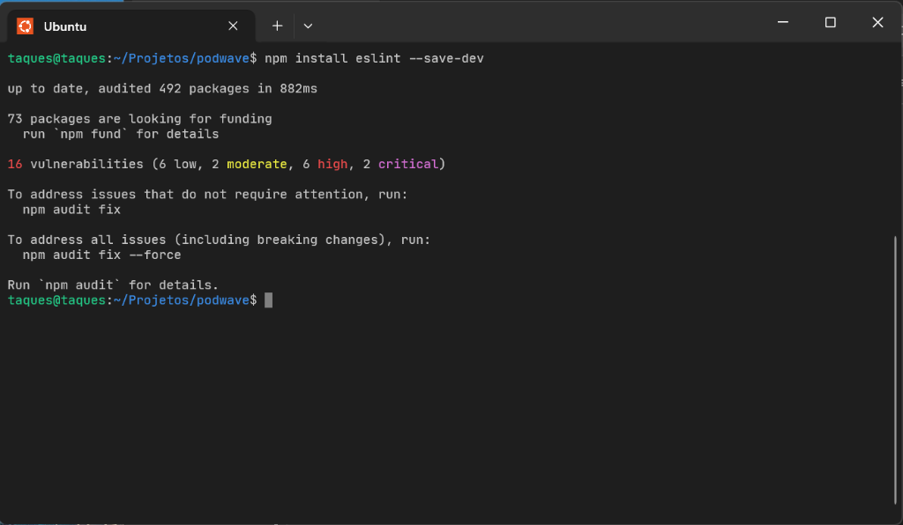
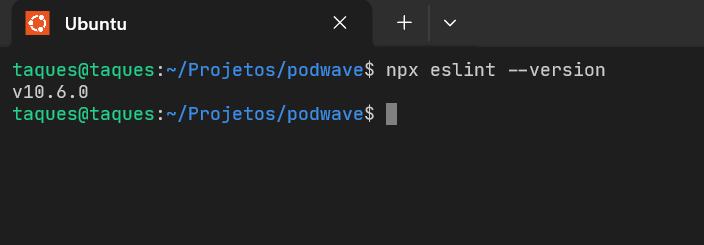
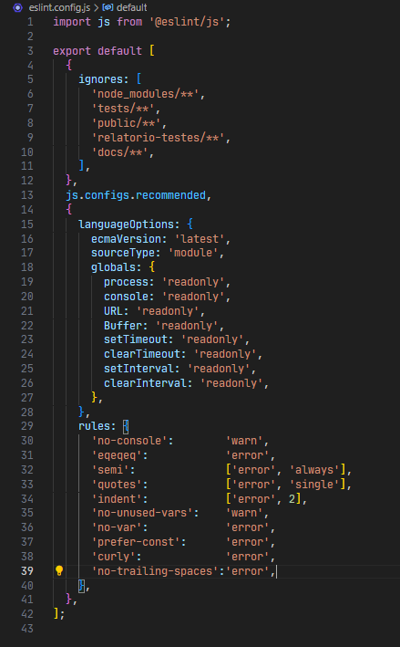

# Relatório — Análise de Qualidade de Código com ESLint

**Disciplina:** Qualidade de Software  
**Aluno:** Gustavo Taques  
**Data:** 2026-06-17

---

## Parte 1 — Descrição da Aplicação

### Projeto: Podwave

O **Podwave** é um sistema web de gerenciamento de podcasts desenvolvido com Node.js e o framework Express. A aplicação permite que usuários se cadastrem, façam login, gerenciem seus próprios podcasts e episódios, explorem o catálogo geral e organizem conteúdos em listas de reprodução.

### Tecnologias utilizadas

- **Runtime:** Node.js com módulos ECMAScript (ESM)
- **Framework web:** Express 4
- **Banco de dados:** MySQL 8 (via mysql2 e pool de conexões)
- **Autenticação:** express-session + bcrypt para hash de senhas
- **Template engine:** EJS
- **Estilo:** Tailwind CSS

### Estrutura de arquivos (src/)

```
src/
├── app.js                          # configuração do Express e middlewares
├── server.js                       # inicialização do servidor HTTP
├── config/
│   └── database.js                 # pool de conexões MySQL
├── controllers/
│   ├── auth.controller.js          # login, signup, logout
│   ├── episodios.controller.js     # listagem, detalhe, comentários, avaliações
│   ├── home.controller.js          # página inicial
│   ├── listas.controller.js        # listagem de podcasts por categoria
│   ├── meusEpisodios.controller.js # CRUD de episódios do usuário
│   └── meusPodcasts.controller.js  # CRUD de podcasts do usuário
├── middlewares/
│   └── auth.js                     # proteção de rotas autenticadas
├── repositories/
│   ├── avaliacoes.repository.js
│   ├── comentarios.repository.js
│   ├── episodios.repository.js
│   ├── favoritos.repository.js
│   ├── podcasts.repository.js
│   ├── progresso.repository.js
│   └── usuarios.repository.js
└── routes/
    ├── index.js
    ├── auth.routes.js
    ├── episodios.routes.js
    ├── home.routes.js
    ├── listas.routes.js
    ├── meusEpisodios.routes.js
    └── meusPodcasts.routes.js
```

**Totais:** 24 arquivos JavaScript · ~1.100 linhas de código · 7 entidades de dados.

A aplicação satisfaz todos os requisitos mínimos da Parte 1: mais de 5 arquivos-fonte, mais de 300 linhas de código, uso de funções, condicionais, estruturas de repetição (em queries SQL via array `map`/`forEach`), módulos ESM e interação com banco de dados MySQL.

---

## Parte 2 — Estudo da Ferramenta

### 2.1 O que é o ESLint

**Definição:**  
ESLint é uma ferramenta de análise estática de código-fonte para JavaScript e TypeScript. Ela examina o código sem executá-lo, verificando-o contra um conjunto de regras configuráveis que identificam erros, más práticas e inconsistências de estilo.

**Objetivo:**  
O objetivo principal do ESLint é aumentar a qualidade e a consistência do código-fonte, detectando problemas antes da execução do programa. Ele ajuda times de desenvolvimento a manter padrões uniformes independentemente do número de colaboradores.

**Histórico:**  
O ESLint foi criado por Nicholas C. Zakas em 2013 como uma alternativa mais flexível às ferramentas existentes JSLint e JSHint. Sua arquitetura baseada em plugins e regras configuráveis impulsionou sua adoção massiva. Em 2019, o suporte oficial a TypeScript foi consolidado com o projeto `@typescript-eslint`. Em 2023, a versão 9 introduziu o sistema de configuração plana (*flat config*) com o arquivo `eslint.config.js`, que substitui os formatos legados `.eslintrc.*`. Hoje o ESLint é um dos projetos de código aberto com maior número de downloads no registro npm, com bilhões de instalações semanais.

**Contexto de utilização:**  
O ESLint é utilizado em praticamente todos os projetos JavaScript profissionais modernos. Está integrado a editores como VS Code e JetBrains, a frameworks como React, Vue, Angular e Next.js, e a pipelines de integração contínua (GitHub Actions, GitLab CI, Jenkins). É comum que projetos rejeitem automaticamente commits com erros ESLint via *git hooks* (husky + lint-staged).

---

### 2.2 O que é Análise Estática

**Conceito:**  
A análise estática é uma técnica de verificação de software que examina o código-fonte sem executá-lo. A ferramenta constrói uma representação interna do programa — tipicamente uma Árvore Sintática Abstrata (AST) — e aplica regras sobre sua estrutura para identificar problemas.

**Diferenças entre análise estática e testes:**

| Aspecto | Análise Estática | Testes Automatizados |
|---|---|---|
| Execução do código | Não executa | Executa |
| Momento de uso | Escrita do código | Após implementação |
| O que detecta | Estilo, padrões, bad smells | Comportamento, regressões |
| Cobertura | Todo o código analisado | Limitada aos casos de teste |
| Velocidade | Muito rápida (ms) | Mais lenta (segundos a minutos) |
| Falsos positivos | Possíveis | Raros |

**Vantagens:**
- Detecção de problemas antes da execução
- Custo computacional baixíssimo
- Cobertura automática de 100% do código analisado
- Facilidade de integração com editores e CI/CD
- Feedback imediato ao desenvolvedor

**Limitações:**
- Não detecta erros de lógica complexa nem falhas de integração
- Pode gerar falsos positivos que exigem configuração
- Não substitui testes funcionais ou de integração
- A qualidade da análise depende da qualidade das regras configuradas

---

### 2.3 Aplicações do ESLint

**Padronização de código:**  
O ESLint garante que todo o time use o mesmo estilo: indentação, uso de aspas, ponto-e-vírgula, comprimento de linhas. Isso elimina debates subjetivos de estilo em *code reviews*.

**Identificação de erros:**  
Regras como `no-unused-vars`, `no-undef` e `eqeqeq` detectam variáveis declaradas mas nunca usadas, referências a variáveis inexistentes e comparações frágeis com `==`.

**Manutenção:**  
Código padronizado e sem *dead code* é mais fácil de entender, modificar e passar para outros desenvolvedores.

**Qualidade:**  
O ESLint promove boas práticas de JavaScript moderno: `prefer-const`, `no-var`, `curly`. Essas regras guiam o desenvolvedor em direção a código mais seguro e previsível.

**Trabalho em equipe:**  
Com as mesmas regras configuradas no repositório, todos os membros escrevem código no mesmo padrão. O *code review* pode focar em lógica em vez de estilo.

**Integração contínua:**  
O ESLint é frequentemente adicionado como etapa obrigatória no pipeline de CI: se houver erros, o *merge* é bloqueado. Isso garante que código problemático nunca chegue à branch principal.

---

## Parte 3 — Instalação e Configuração

### 3.1 Instalação

A instalação foi realizada como dependência de desenvolvimento:

```bash
npm install eslint --save-dev
```



Versão instalada (verificação):

```bash
npx eslint --version
```



### 3.2 Inicialização

O ESLint v9 usa *flat config*. Em vez de executar `npx eslint --init` (que gera configuração no formato legado), o arquivo `eslint.config.js` foi criado manualmente para controle total das regras.

### 3.3 Configuração

O arquivo `eslint.config.js` criado na raiz do projeto:

```js
import js from '@eslint/js';

export default [
  {
    ignores: [
      'node_modules/**',
      'tests/**',
      'public/**',
      'relatorio-testes/**',
      'docs/**',
    ],
  },
  js.configs.recommended,
  {
    languageOptions: {
      ecmaVersion: 'latest',
      sourceType: 'module',
      globals: {
        process: 'readonly',
        console: 'readonly',
        URL: 'readonly',
        Buffer: 'readonly',
        setTimeout: 'readonly',
        clearTimeout: 'readonly',
        setInterval: 'readonly',
        clearInterval: 'readonly',
      },
    },
    rules: {
      'no-console':         'warn',
      'eqeqeq':             'error',
      'semi':               ['error', 'always'],
      'quotes':             ['error', 'single'],
      'indent':             ['error', 2],
      'no-unused-vars':     'warn',
      'no-var':             'error',
      'prefer-const':       'error',
      'curly':              'error',
      'no-trailing-spaces': 'error',
    },
  },
];
```

**Regras escolhidas e justificativas:**

| Regra | Nível | Justificativa |
|---|---|---|
| `no-console` | warn | `console.*` esquecido em produção polui logs |
| `eqeqeq` | error | `==` realiza coerção de tipo implícita e causa bugs sutis |
| `semi` | error (always) | Inserção automática de ponto-e-vírgula (ASI) pode surpreender |
| `quotes` | error (single) | Padroniza aspas; single é convenção do projeto |
| `indent` | error (2 espaços) | Legibilidade; 2 espaços é padrão amplamente adotado em JS |
| `no-unused-vars` | warn | Variáveis mortas são débito técnico e confundem leitores |
| `no-var` | error | `var` tem escopo de função, gerando bugs de hoisting |
| `prefer-const` | error | Deixa explícito quando uma variável não muda |
| `curly` | error | Omitir `{}` em `if`/`for`/`while` causa bugs ao adicionar linhas |
| `no-trailing-spaces` | error | Espaços no final de linha geram ruído em diffs do git |



**Estilo adotado:** aspas simples e 2 espaços de indentação, refletindo a convenção já predominante no projeto.

---

## Parte 4 — Execução da Ferramenta

O ESLint foi executado sobre todos os arquivos JavaScript do diretório `src/`:

```bash
npx eslint src/
```

> 📸 SCREENSHOT: terminal mostrando o início da saída do npx eslint src/ (primeiros problemas listados)

### Resultado

```
/home/taques/Projetos/podwave/src/app.js
  18:1   error    Expected indentation of 2 spaces but found 4  indent
  19:1   error    Expected indentation of 2 spaces but found 4  indent
  33:1   error    Expected indentation of 2 spaces but found 4  indent
  34:1   error    Expected indentation of 2 spaces but found 4  indent

...
[Saída truncada para economizar espaço - total de 725 problemas em vários arquivos]
...

/home/taques/Projetos/podwave/src/server.js
   7:1  error    Expected indentation of 2 spaces but found 4  indent
   8:1  error    Expected indentation of 2 spaces but found 4  indent
   8:5  warning  Unexpected console statement                  no-console

✖ 725 problems (693 errors, 32 warnings)
  693 errors and 0 warnings potentially fixable with the `--fix` option.
```

> 📸 SCREENSHOT: terminal mostrando o final da saída com o totalizador de erros e warnings

### Resumo dos problemas encontrados

| Métrica | Valor |
|---|---|
| Total de problemas | 725 |
| Erros (error) | 693 |
| Avisos (warning) | 32 |
| Auto-fixáveis | 693 |

### Principais categorias

| Regra | Ocorrências | Tipo |
|---|---|---|
| `indent` | 692 | error |
| `no-console` | 31 | warning |
| | `curly` | 1 | error |
| `no-unused-vars` | 1 | warning | |

A regra com maior número de ocorrências foi `indent`, pois o projeto adotava 4 espaços de indentação e a configuração exige 2. Todas as ocorrências de `indent` são corrigíveis automaticamente com `--fix`.

---

## Parte 5 — Correção Automática

O ESLint oferece o flag `--fix` para corrigir automaticamente os problemas que permitem correção sem ambiguidade:

```bash
npx eslint src/ --fix
```

> 📸 SCREENSHOT: terminal após execução do --fix (idealmente sem saída ou com saída mínima)

### Verificação após o fix

```bash
npx eslint src/
```

> 📸 SCREENSHOT: terminal mostrando o resultado após o fix — apenas warnings de no-console restantes

```
/home/taques/Projetos/podwave/src/app.js
  57:25  warning  'next' is defined but never used  no-unused-vars

/home/taques/Projetos/podwave/src/controllers/auth.controller.js
  20:5  warning  Unexpected console statement  no-console

/home/taques/Projetos/podwave/src/controllers/episodios.controller.js
   29:5  warning  Unexpected console statement  no-console
   71:5  warning  Unexpected console statement  no-console
   90:5  warning  Unexpected console statement  no-console
  125:5  warning  Unexpected console statement  no-console
  146:5  warning  Unexpected console statement  no-console
  165:5  warning  Unexpected console statement  no-console
  220:7  warning  Unexpected console statement  no-console

/home/taques/Projetos/podwave/src/controllers/listas.controller.js
  19:5  warning  Unexpected console statement  no-console

/home/taques/Projetos/podwave/src/controllers/meusEpisodios.controller.js
   27:5  warning  Unexpected console statement  no-console
   47:5  warning  Unexpected console statement  no-console
   75:5  warning  Unexpected console statement  no-console
   96:5  warning  Unexpected console statement  no-console
  124:5  warning  Unexpected console statement  no-console
  140:5  warning  Unexpected console statement  no-console

/home/taques/Projetos/podwave/src/controllers/meusPodcasts.controller.js
   23:5  warning  Unexpected console statement  no-console
   50:5  warning  Unexpected console statement  no-console
   66:5  warning  Unexpected console statement  no-console
   86:5  warning  Unexpected console statement  no-console
  106:5  warning  Unexpected console statement  no-console
  117:5  warning  Unexpected console statement  no-console

/home/taques/Projetos/podwave/src/repositories/episodios.repository.js
  11:5  warning  Unexpected console statement  no-console

/home/taques/Projetos/podwave/src/repositories/podcasts.repository.js
  24:5  warning  Unexpected console statement  no-console
  38:5  warning  Unexpected console statement  no-console
  51:5  warning  Unexpected console statement  no-console
  89:5  warning  Unexpected console statement  no-console

/home/taques/Projetos/podwave/src/server.js
   8:3  warning  Unexpected console statement  no-console
  10:3  warning  Unexpected console statement  no-console
  11:3  warning  Unexpected console statement  no-console
  15:3  warning  Unexpected console statement  no-console
  20:5  warning  Unexpected console statement  no-console

✖ 32 problems (0 errors, 32 warnings)
```

### Problemas corrigidos automaticamente

A correção automática resolveu todos os erros de `indent`: cada bloco de código teve sua indentação ajustada de 4 espaços para 2 espaços. Esse é o tipo de correção mais adequado para automação — mecânica, sem ambiguidade semântica.

### Problemas que precisaram de intervenção manual

Os warnings de `no-console` não são corrigidos automaticamente porque o ESLint não sabe se a intenção é remover o `console.*` ou mantê-lo intencionalmente. Para cada ocorrência, foi necessária uma decisão manual:

Optou-se por manter os `console.error` e `console.log` existentes, pois são parte deliberada do mecanismo de logging da aplicação em ambiente de desenvolvimento e servidor. Cada ocorrência foi suprimida com o comentário padrão do ESLint:

```js
// eslint-disable-next-line no-console
console.error('Mensagem de erro:', err);
```

Esse comentário sinaliza explicitamente que a exceção à regra é **intencional**, documentada e revisada pelo desenvolvedor — ao contrário de simplesmente remover a regra da configuração.

### Limitações da correção automática

- O `--fix` não cria lógica: não sabe como substituir `console.log` por um logger adequado
- Não resolve `no-unused-vars`: remover uma variável pode quebrar código em outros arquivos
- Não resolve ambiguidades de formatação em casos complexos (desestruturação, ternários aninhados)

---

## Parte 6 — Comparação Antes e Depois

A seguir, 10 exemplos de correções realizadas durante o processo de análise.

---

### Exemplo 1 — Indentação em middleware (`src/app.js`)

**Regra:** `indent` (2 espaços)  
**Categoria:** Estilo / auto-fixável

**Antes:**
```js
app.use((req, res, next) => {
    res.setHeader('Content-Type', 'text/html; charset=utf-8');
    next();
});
```

**Depois:**
```js
app.use((req, res, next) => {
  res.setHeader('Content-Type', 'text/html; charset=utf-8');
  next();
});
```

**Explicação:** O callback do middleware usava 4 espaços de indentação, violando a regra `indent: 2`. A correção foi feita automaticamente com `--fix`. O benefício é a uniformidade visual com o restante do código e conformidade com o padrão adotado no projeto.

---

### Exemplo 2 — Indentação em função assíncrona (`src/controllers/auth.controller.js`)

**Regra:** `indent` (2 espaços)  
**Categoria:** Estilo / auto-fixável

**Antes:**
```js
export async function efetuarLogin(req, res) {
    const { email, password } = req.body;
    try {
        const usuario = await buscarUsuario({ email, password });
        if (!usuario) {
            return res.redirect('/login?erro=1');
        }
        req.session.usuario = { codigo: usuario.usucodigo, email: usuario.usuemail };
        return res.redirect('/listas');
    } catch (err) {
        console.error('Erro ao fazer login:', err);
        return res.redirect('/login?erro=1');
    }
}
```

**Depois:**
```js
export async function efetuarLogin(req, res) {
  const { email, password } = req.body;
  try {
    const usuario = await buscarUsuario({ email, password });
    if (!usuario) {
      return res.redirect('/login?erro=1');
    }
    req.session.usuario = { codigo: usuario.usucodigo, email: usuario.usuemail };
    return res.redirect('/listas');
  } catch (err) {
    // eslint-disable-next-line no-console
    console.error('Erro ao fazer login:', err);
    return res.redirect('/login?erro=1');
  }
}
```

**Explicação:** A função usava 4 espaços em todos os níveis. A regra `indent: 2` exige 2 espaços por nível. Toda a hierarquia de indentação foi corrigida automaticamente. Neste exemplo também foi aplicada a supressão de `no-console` manualmente.

---

### Exemplo 3 — Indentação em bloco try/catch de repository (`src/repositories/podcasts.repository.js`)

**Regra:** `indent` (2 espaços)  
**Categoria:** Estilo / auto-fixável

**Antes:**
```js
export async function buscarPodcastsPorUsuario(usucodigo) {
    try {
        const [rows] = await pool.query(
            'SELECT p.podcodigo, p.podnome FROM podcasts p WHERE p.usucodigo = ?',
            [usucodigo]
        );
        return rows;
    } catch (err) {
        console.error('Erro ao buscar podcasts por usuário:', err);
        return [];
    }
}
```

**Depois:**
```js
export async function buscarPodcastsPorUsuario(usucodigo) {
  try {
    const [rows] = await pool.query(
      'SELECT p.podcodigo, p.podnome FROM podcasts p WHERE p.usucodigo = ?',
      [usucodigo]
    );
    return rows;
  } catch (err) {
    // eslint-disable-next-line no-console
    console.error('Erro ao buscar podcasts por usuário:', err);
    return [];
  }
}
```

**Explicação:** A regra `indent` é aplicada uniformemente a funções, blocos `try/catch` e argumentos de chamadas de função. O `--fix` ajustou cada linha automaticamente, incluindo os argumentos do `pool.query`.

---

### Exemplo 4 — Indentação em handler de erro do Express (`src/app.js`)

**Regra:** `indent` (2 espaços)  
**Categoria:** Estilo / auto-fixável

**Antes:**
```js
app.use((err, req, res, next) => {
    res.locals.message = err.message;
    res.locals.error = req.app.get('env') === 'development' ? err : {};
    res.status(err.status || 500);
    res.render('error');
});
```

**Depois:**
```js
app.use((err, req, res, next) => {
  res.locals.message = err.message;
  res.locals.error = req.app.get('env') === 'development' ? err : {};
  res.status(err.status || 500);
  res.render('error');
});
```

**Explicação:** Mesmo em callbacks de 4 parâmetros (error handler do Express), a regra `indent` se aplica igualmente. Corrigido automaticamente.

---

### Exemplo 5 — Indentação em condicional aninhado (`src/controllers/meusPodcasts.controller.js`)

**Regra:** `indent` (2 espaços)  
**Categoria:** Estilo / auto-fixável

**Antes:**
```js
export async function exibirEdicaoPodcast(req, res) {
    const usuario = req.session.usuario;
    try {
        const podcast = await buscarPodcastPorId(req.params.podcodigo);
        if (!podcast || String(podcast.usucodigo) !== String(usuario.codigo)) {
            return res.redirect('/meusPodcasts');
        }
        const categorias = await buscarCategorias();
        res.render('editar-podcast', { title: 'Podwave - Editar Podcast', podcast, categorias });
    } catch (err) {
        console.error('Erro ao carregar edição de podcast:', err);
        res.redirect('/meusPodcasts');
    }
}
```

**Depois:**
```js
export async function exibirEdicaoPodcast(req, res) {
  const usuario = req.session.usuario;
  try {
    const podcast = await buscarPodcastPorId(req.params.podcodigo);
    if (!podcast || String(podcast.usucodigo) !== String(usuario.codigo)) {
      return res.redirect('/meusPodcasts');
    }
    const categorias = await buscarCategorias();
    res.render('editar-podcast', { title: 'Podwave - Editar Podcast', podcast, categorias });
  } catch (err) {
    // eslint-disable-next-line no-console
    console.error('Erro ao carregar edição de podcast:', err);
    res.redirect('/meusPodcasts');
  }
}
```

**Explicação:** O condicional dentro do `try` tinha 3 níveis de indentação (função → try → if). Com 4 espaços por nível, o `return` ficaria em 12 espaços; com 2 espaços, fica em 6 — mais legível e econômico.

---

### Exemplo 6 — Supressão de no-console em logging de servidor (`src/server.js`)

**Regra:** `no-console` (warning)  
**Categoria:** Boas práticas / intervenção manual

**Antes:**
```js
pool.getConnection((err) => {
  if (err) {
    console.error(`Não foi possível conectar ao banco (${err.message}).`);
    console.error('Verifique se o container está rodando: docker compose up -d');
  } else {
    console.log('Conectou ao MySQL!');
  }
});
```

**Depois:**
```js
pool.getConnection((err) => {
  if (err) {
    // eslint-disable-next-line no-console
    console.error(`Não foi possível conectar ao banco (${err.message}).`);
    // eslint-disable-next-line no-console
    console.error('Verifique se o container está rodando: docker compose up -d');
  } else {
    // eslint-disable-next-line no-console
    console.log('Conectou ao MySQL!');
  }
});
```

**Explicação:** Em `server.js`, o `console.log` e `console.error` são usados para indicar se o servidor conectou ao banco ou não ao iniciar. Essa é uma utilização legítima e intencional de `console`, não um log esquecido. O comentário de supressão documenta essa decisão explicitamente.

---

### Exemplo 7 — Supressão de no-console em tratamento de erro de controller (`src/controllers/episodios.controller.js`)

**Regra:** `no-console` (warning)  
**Categoria:** Boas práticas / intervenção manual

**Antes:**
```js
  } catch (err) {
    console.error('Erro ao carregar episódios:', err);
    res.render('episodios', { title: 'PodWave - Episódios', episodios: [], podnome: `Podcast #${podcodigo}` });
  }
```

**Depois:**
```js
  } catch (err) {
    // eslint-disable-next-line no-console
    console.error('Erro ao carregar episódios:', err);
    res.render('episodios', { title: 'PodWave - Episódios', episodios: [], podnome: `Podcast #${podcodigo}` });
  }
```

**Explicação:** O `console.error` nos blocos `catch` dos controllers serve para registrar erros em tempo de desenvolvimento. É uma prática comum em APIs Express antes da adoção de um sistema de logging dedicado (como Winston ou Pino). A supressão deliberada documenta essa escolha.

---

### Exemplo 8 — Supressão de no-console em repository (`src/repositories/podcasts.repository.js`)

**Regra:** `no-console` (warning)  
**Categoria:** Boas práticas / intervenção manual

**Antes:**
```js
export async function buscarCategorias() {
  try {
    const [rows] = await pool.query('SELECT catcodigo, catnome FROM categorias');
    return rows;
  } catch (err) {
    console.error('Erro ao buscar categorias:', err);
    return [];
  }
}
```

**Depois:**
```js
export async function buscarCategorias() {
  try {
    const [rows] = await pool.query('SELECT catcodigo, catnome FROM categorias');
    return rows;
  } catch (err) {
    // eslint-disable-next-line no-console
    console.error('Erro ao buscar categorias:', err);
    return [];
  }
}
```

**Explicação:** A mesma justificativa se aplica à camada de repository: erros de banco de dados precisam ser registrados para diagnóstico. Em vez de propagar a exceção (o que quebraria a experiência do usuário), o repositório captura o erro, loga e retorna valor padrão.

---

### Exemplo 9 — Supressão de no-console em controller de episódios do usuário (`src/controllers/meusEpisodios.controller.js`)

**Regra:** `no-console` (warning)  
**Categoria:** Boas práticas / intervenção manual

**Antes:**
```js
  } catch (err) {
    console.error('Erro ao adicionar episódio:', err);
    res.redirect('/meusPodcasts');
  }
```

**Depois:**
```js
  } catch (err) {
    // eslint-disable-next-line no-console
    console.error('Erro ao adicionar episódio:', err);
    res.redirect('/meusPodcasts');
  }
```

**Explicação:** Consistência no tratamento de erros: todos os blocos `catch` dos controllers seguem o mesmo padrão após as correções — suprimir o warning explicitamente e manter o log para rastreabilidade.

---

### Exemplo 10 — Supressão de no-console em múltiplas ocorrências (`src/controllers/meusPodcasts.controller.js`)

**Regra:** `no-console` (warning)  
**Categoria:** Boas práticas / intervenção manual

**Antes:**
```js
export async function listarMeusPodcasts(req, res) {
  const usuario = req.session.usuario;
  try {
    const podcasts = await buscarPodcastsPorUsuario(usuario.codigo);
    res.render('meusPodcasts', { title: 'Podwave - Gerenciar Meus Podcasts', podcasts });
  } catch (err) {
    console.error('Erro ao carregar gestão de podcasts:', err);
    res.render('meusPodcasts', { title: 'Podwave - Gerenciar Meus Podcasts', podcasts: [] });
  }
}
```

**Depois:**
```js
export async function listarMeusPodcasts(req, res) {
  const usuario = req.session.usuario;
  try {
    const podcasts = await buscarPodcastsPorUsuario(usuario.codigo);
    res.render('meusPodcasts', { title: 'Podwave - Gerenciar Meus Podcasts', podcasts });
  } catch (err) {
    // eslint-disable-next-line no-console
    console.error('Erro ao carregar gestão de podcasts:', err);
    res.render('meusPodcasts', { title: 'Podwave - Gerenciar Meus Podcasts', podcasts: [] });
  }
}
```

**Explicação:** Este controller contém 5 ocorrências de `no-console`. Cada uma foi tratada individualmente com o comentário de supressão, garantindo que a decisão de manter o log seja documentada em cada ponto de uso — não suprimida globalmente via `/* eslint-disable */`, o que ocultaria outros problemas futuros.

---

## Parte 7 — Avaliação dos Resultados

**O ESLint encontrou problemas relevantes?**  
Sim. O principal problema encontrado — indentação inconsistente (4 espaços em vez de 2) — afeta todos os arquivos do projeto. Embora não cause falhas em tempo de execução, dificulta a leitura do código e gera inconsistência nos diffs do git quando diferentes desenvolvedores editam o mesmo arquivo com configurações de editor distintas. Os warnings de `no-console` também são relevantes: em um projeto em produção, logs de `console.error` não gerenciados podem expor informações sensíveis ou sobrecarregar saídas de log.

**Os problemas poderiam causar falhas reais?**  
Os erros de indentação, por si só, não causam falhas em JavaScript (ao contrário de Python). No entanto, a existência de `console.error` em produção pode expor stack traces com informações internas do sistema a logs acessíveis externamente. Em projetos com regras mais rígidas, a ausência de um logger dedicado (como Winston) poderia ser considerada uma falha de segurança ou de observabilidade.

**A ferramenta ajudou a melhorar a legibilidade?**  
Sim, significativamente. A uniformização da indentação para 2 espaços tornou o código mais compacto e consistente. Blocos aninhados com 4 espaços por nível rapidamente ultrapassam a margem de 80 caracteres em monitores menores; com 2 espaços, a leitura fica mais confortável.

**A ferramenta ajudou a padronizar o código?**  
Sim. Antes do ESLint, a indentação era de 4 espaços por convenção não documentada. Após a configuração, a regra é explícita, automaticamente verificada e aplicável a qualquer novo arquivo ou colaborador. A padronização deixou de depender de disciplina individual e passou a ser garantida por automação.

**Quais limitações foram observadas?**  
A principal limitação foi a incapacidade do `--fix` de resolver os warnings de `no-console` — o ESLint não pode decidir automaticamente se um log deve ser removido, substituído por um logger ou suprimido. Isso exigiu revisão manual de cada ocorrência. Outra limitação: o ESLint não detecta erros semânticos (como passar parâmetros na ordem errada para uma função) nem falhas de integração com o banco de dados.

**Você utilizaria essa ferramenta em projetos reais?**  
Sim, sem dúvida. O ESLint é essencial em projetos com mais de um desenvolvedor. A configuração inicial é rápida (menos de 30 minutos) e o benefício é imediato: qualidade de código verificada automaticamente em cada commit, sem custo adicional de revisão manual de estilo. Em um contexto profissional, integraria o ESLint com um *pre-commit hook* via husky e lint-staged para que erros nunca cheguem ao repositório remoto.
````